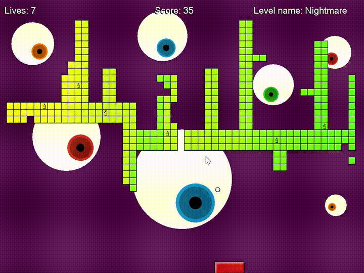

# Arkanoid Game


This Arkanoid game was made for an Object-Oriented Programming (OOP) course at [Bar-Ilan University](https://github.com/ariecattan/biuoop2021/wiki). In addition to the base requirements, several enhancements have been added, including background music, sound effects, bonuses upon breaking "gift" blocks, and two custom levels. Cosmetic improvements have also been made.

## Launch Parameters (Arguments):

- `noDie`: Balls will bounce from the bottom, essentially enabling god mode.
- `mute`: Launch the game without sounds.
- `1`: "Direct Hit" level.
- `2`: "Wide Easy" level.
- `3`: "Green 3" level.
- `4`: "Final Four" level.
- `5`: "Nightmare" level.
- `6`: "Invaders!" level.

For example, to launch the "Invaders!" level in god mode, you can use the following command:

```shell
java -jar ass6.jar 6 noDie
```

## Controls:

- `m`: Mute the game sounds.
- `p`: Pause the game.
- `right` / `left`: Move the paddle.

## Screenshots:



```
